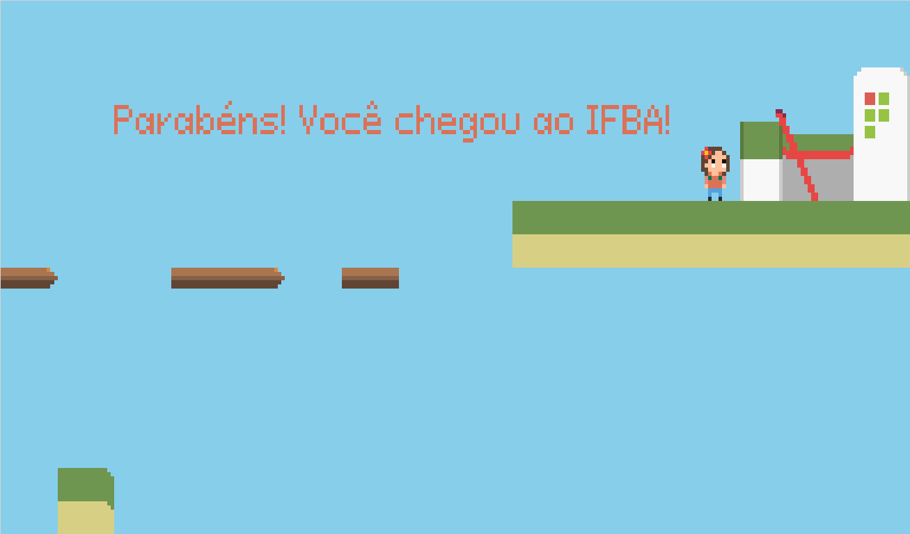
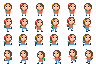

# Jogo de Plataforma: Vida de Estudante

O jogo “Vida de Estudante” é uma aplicação do tipo plataforma bidimensional, onde Cecília, uma aluna aplicada, tenta chegar à escola, desviando de obstáculos como Ansiedade e Preguiça. O objetivo do jogo é levar Cecília à escola em segurança. No jogo, pode-se pular em plataformas e desviar de obstáculos. 

# Regras

As regras de “Vida de Estudante” são as seguintes:
- Leve a Ceci até a escola sem deixá-la cair nas fendas;
- Desvie dos inimigos Ansiedade e Preguiça, senão o jogo será reiniciado;

Utilize atalhos como as plataformas elevadas.
Os botões de movimentação são estes:
- d ou D = direita;
- a ou A = esquerda;
- w ou W = para cima.

## Tecnologias usadas
- Html
- Css
- Javascript
- API do canvas

## Implementação

Há quatro arquivos javascript: main.js, classes.js, movimento.js e mapas.js. No arquivo
main está o loop principal do jogo, a instância dos objetos e a chamada das funções. No
classes.js estão quatro classes: ImagemAnimada, Personagem, Inimigo e Camera, Personagem
e Inimigo herdam ImagemAnimada, esta contém física, colisão e o básico para cada classe
filha implementar animação.

O arquivo movimento.js têm eventListeners que detectam o clique das teclas, e o
arquivo mapas.js contém uma estrutura de dados para representar o mapa do jogo (contou
com ajuda do programa Tiled para desenhar o mapa), assim como uma função que desenha o
cenário com base nas posições do mapa que estão visíveis no jogo relativas à posição da
câmera, esta segue o jogador.

As artes do jogo foram feitas no Krita. Os blocos do mundo são recortes de 16 por 16 pixels na imagem, eles são representados por um índice inteiro.

